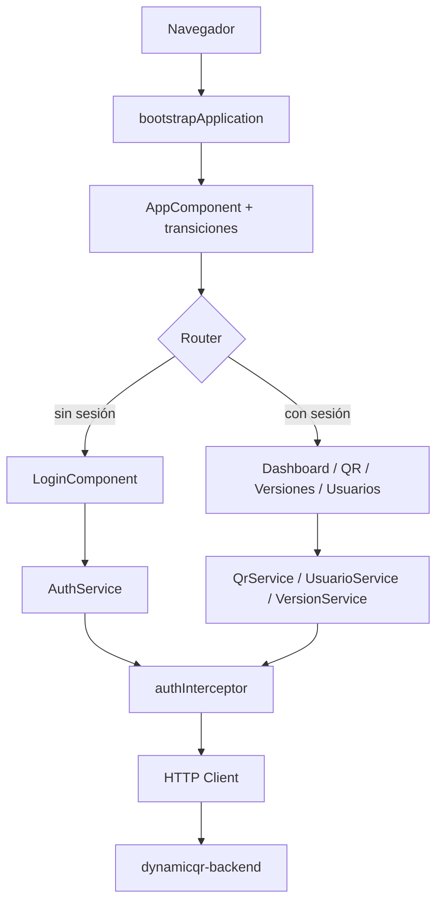
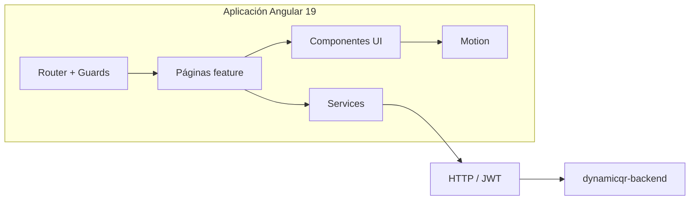
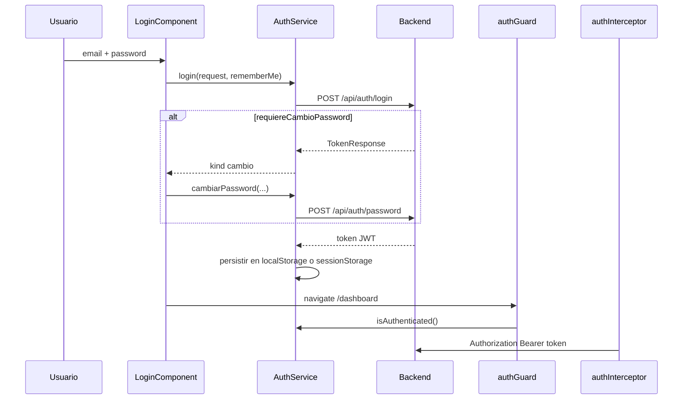
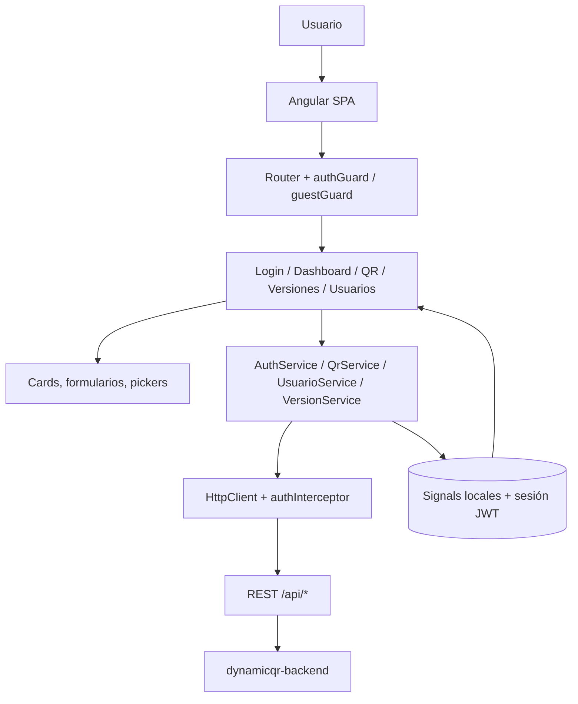

# DynamicQR Frontend

Cliente web de administración para **DynamicQR**: autenticación, gestión de códigos QR dinámicos, usuarios e historial de versiones.

<p align="center">
  
</p>

<p align="center">
  
  
  
  
  
</p>

<p align="center">
  <a href="https://github.com/Guts-CM/dynamicqr-frontend"></a>
  
  
</p>

---

## 📋 Descripción

**DynamicQR Frontend** es una SPA (Single Page Application) en Angular 19 que consume el backend `dynamicqr-backend`. Permite iniciar sesión con JWT, crear y editar códigos QR con estilo visual, administrar usuarios y consultar el historial de cambios (versiones) de cada código.

El frontend no genera el archivo QR por sí mismo: envía metadatos y estilo al API, y muestra o descarga el SVG/PNG que el backend expone.

---

## ✨ Características

- Login con email y contraseña, opción **Recuérdame** y cambio obligatorio de contraseña temporal.
- Panel de control con perfil de sesión, gráfica de códigos creados (últimos 6 meses) y últimos registros QR.
- CRUD de códigos QR: listado, detalle, creación, edición de contenido/estilo, descarga SVG/PNG y activación/desactivación.
- Tipos de QR: URL, texto, Wi-Fi, vCard, email y teléfono.
- Estilo de QR: paletas, colores, fondo transparente y formas de módulos/ojos, con vista previa en cliente.
- Directorio de usuarios: alta, edición, búsqueda, activación/desactivación y generación de contraseña temporal.
- Historial de versiones (solo lectura): listado, búsqueda y detalle de cambios de nombre y destino.
- Navegación compartida (escritorio + dock móvil) entre Panel, QR, Versiones y Usuarios.
- Animaciones con Anime.js y respeto de `prefers-reduced-motion`.
- Interceptor HTTP que adjunta el Bearer token y cierra sesión ante `401`.

**Presente en UI, no implementado:**

- Sección **Escaneos** (botón deshabilitado).
- Continuar con Google y registro de cuenta (botones deshabilitados).

---

## 🖥️ Preview

Identidad visual del proyecto (logo en `src/assets/dynamicqr-logo.svg`):

<p align="center">
  
</p>

La interfaz usa un tema oscuro fijo (paleta *limed-spruce*), tipografía Inter/Poppins y tarjetas tipo glass. No hay capturas de pantalla en el repositorio.

---

## 🧠 ¿Cómo funciona?

1. El navegador carga `index.html` y Angular arranca `AppComponent`.
2. El router elige login (invitado) o una sección autenticada.
3. La página pide datos a servicios (`AuthService`, `QrService`, `UsuarioService`, `VersionService`).
4. `HttpClient` llama a `{apiBaseUrl}/api/...` con JWT cuando aplica.
5. La respuesta se mapea a modelos (`QrResponse`, `UsuarioResponse`, `VersionResponse`) y se guarda en signals locales.
6. La plantilla se actualiza; errores y vacíos se muestran en la UI.



---

## 🏗️ Arquitectura

Arquitectura **feature-based** con componentes standalone (sin `NgModule` de aplicación). Cada dominio vive en `src/app/components/{feature}` junto a sus modelos y, cuando aplica, su servicio.

| Capa | Ubicación | Rol |
|---|---|---|
| Arranque | `src/main.ts`, `app.config.ts`, `app.routes.ts` | Bootstrap, router, HTTP e interceptor |
| Features | `components/login`, `dashboard`, `qr`, `usuario`, `version` | Pantallas y subcomponentes |
| Auth | `components/auth` | Guard, interceptor, modelos de sesión |
| Servicios | `components/service` y `qr.service.ts` / `version.service.ts` | Acceso HTTP |
| Motion | `src/app/motion` | Animaciones, tokens y directivas |
| Config | `src/environments` | `apiBaseUrl` y bandera `production` |

No hay NgRx, Redux ni store global. El estado de sesión está en `AuthService` (signals); el resto es estado local de cada página.



---

## 🛠️ Tecnologías

Versiones según `package.json` y `package-lock.json`.

| Tecnología | Versión | Propósito |
|---|---|---|
| Angular | ^19.2.0 (lock: 19.2.25) | Framework SPA, components, signals, DI |
| Angular CLI / DevKit | ^19.2.27 | `ng serve`, `ng build`, `ng test` |
| TypeScript | ~5.7.2 (lock: 5.7.3) | Lenguaje |
| RxJS | ~7.8.0 (lock: 7.8.2) | HTTP, `switchMap`, `forkJoin`, ciclo de vida |
| Zone.js | ~0.15.0 (lock: 0.15.1) | Change detection |
| Angular Router | ^19.2.0 | Rutas, guards, query params |
| Angular HttpClient | ^19.2.0 | Cliente HTTP + interceptor funcional |
| Angular Reactive Forms | ^19.2.0 | Formularios y validadores |
| Tailwind CSS | ^4.3.3 | Utilidades CSS (`@import "tailwindcss"`) |
| PostCSS | ^8.5.28 | Pipeline CSS (`@tailwindcss/postcss`) |
| Anime.js | ^4.5.0 | Animaciones de UI, QR y transiciones |
| Inter Variable / Poppins | 5.3.0 | Tipografías (`@fontsource`) |
| Jasmine | ~5.6.0 | Tests unitarios |
| Karma | ~6.4.0 (lock: 6.4.4) | Runner de tests |
| EditorConfig | presente | Indentación y charset |
| npm | lockfile v3 | Gestor de paquetes (`angular.json` → `"packageManager": "npm"`) |

**No está en el proyecto:** NgRx, librería de iconos, ESLint/Prettier de proyecto, Docker, CI, tests E2E.

---

## 📁 Estructura

```text
dynamicqr-frontend/
├── angular.json                 # Build, serve, test, fileReplacements
├── package.json                 # Scripts y dependencias
├── .postcssrc.json              # Plugin Tailwind
├── src/
│   ├── index.html               # Título DynamicQR, idioma es
│   ├── main.ts                  # bootstrapApplication
│   ├── styles.css               # Tema Tailwind + scrollbars
│   ├── assets/dynamicqr-logo.svg
│   ├── environments/
│   │   ├── environment.ts       # development
│   │   └── environment.prod.ts  # production
│   └── app/
│       ├── app.config.ts
│       ├── app.routes.ts
│       ├── app.component.*
│       ├── motion/              # Servicio, directivas, tokens, CSS
│       └── components/
│           ├── auth/            # Guard, interceptor, JWT session
│           ├── service/         # AuthService, UsuarioService
│           ├── login/login/
│           ├── dashboard/       # Panel + cards
│           ├── qr/              # Listado, create, estilo, stage, live
│           ├── usuario/
│           └── version/
└── dist/dynamicqr-frontend/     # Salida de build (no versionada)
```

---

## 🧭 Routing

Definido en `src/app/app.routes.ts`. **Sin lazy loading:** todas las páginas se importan de forma eager.

| Ruta | Componente | Guard | Propósito |
|---|---|---|---|
| `/` | `LoginComponent` | `guestGuard` | Login (ruta por defecto) |
| `/login` | `LoginComponent` | `guestGuard` | Login |
| `/dashboard` | `DashboardComponent` | `authGuard` | Panel |
| `/qr` | `QrComponent` | `authGuard` | Gestión de códigos QR |
| `/versiones` | `VersionComponent` | `authGuard` | Historial de versiones |
| `/usuarios` | `UsuarioComponent` | `authGuard` | Directorio de usuarios |
| `**` | — | — | Redirige a `''` |

**Query params reales (solo `/qr`):**

| Parámetro | Efecto |
|---|---|
| `?create=1` | Abre el flujo de creación |
| `?id={qrId}` | Selecciona el código si existe en el listado |

**Guards:**

- `authGuard`: si no hay sesión vigente, redirige a `/login`.
- `guestGuard`: si ya hay sesión, redirige a `/dashboard`.

No existe una página 404: las rutas desconocidas van al login (o al dashboard si hay sesión).

---

## 🧩 Componentes

### Autenticación

| Componente | Responsabilidad |
|---|---|
| `LoginComponent` | Formularios de login y cambio de contraseña temporal. Usa `AuthService` y `QrStageComponent`. |

### Panel

| Componente | Responsabilidad | Datos / API |
|---|---|---|
| `DashboardComponent` | Shell, nav, CTA “Nuevo código QR”, cierre de sesión | Navega a `/qr?create=1` |
| `DashboardUserCardComponent` | Perfil, temporizador JWT, logout al expirar | `AuthService` + `GET /api/usuarios/{id}` |
| `DashboardChartCardComponent` | Barras de códigos creados (6 meses) | `GET /api/qr` |
| `DashboardRecordsCardComponent` | Últimos 6 QR; click → `/qr?id=` | `GET /api/qr` |
| `DashboardReservedCardComponent` | Visual QR interactivo | `QrLiveComponent` (sin API) |

### Códigos QR

| Componente | Responsabilidad |
|---|---|
| `QrComponent` | Listado/detalle, edición, toggle activo, descarga, modo crear |
| `QrCreateComponent` | Formulario de alta + preview SVG local; emite `QrCreatePayload` |
| `QrStylePickerComponent` | Paletas, swatches, formas y fondo transparente |
| `QrStageComponent` | QR animado de fondo en login |
| `QrLiveComponent` | QR 3D/interactivo del dashboard |

### Usuarios y versiones

| Componente | Responsabilidad |
|---|---|
| `UsuarioComponent` | Listado, búsqueda, edición, toggle activo, password temporal |
| `UsuarioCreateComponent` | Alta de usuario; emite `UsuarioCreatePayload` |
| `VersionComponent` | Listado/detalle de versiones (solo lectura) |

### Motion

Directivas `appMotionButton`, `appMotionCard`, `appMotionInput`, `appMotionList`. `SectionTransitionService` anima el cambio de sección en `AppComponent`.

---

## 🔌 Integración con API

**Base URL** (`environment.apiBaseUrl`):

```text
http://localhost:8080/dynamicqr-backend
```

Misma URL en development y production.

### Flujo

```text
Componente  →  Service  →  HttpClient (+ authInterceptor)  →  Backend
                ↓
         modelos Response / payload
                ↓
         signals de la página
```

### Servicios y endpoints

| Servicio | Método | Endpoint | Uso |
|---|---|---|---|
| `AuthService` | `POST` | `/api/auth/login` | Login. Body: `{ email, password }` |
| `AuthService` | `POST` | `/api/auth/password` | Cambio de password temporal. Body: `{ email, password, passwordNueva }` |
| `QrService` | `GET` | `/api/qr` | Listado |
| `QrService` | `GET` | `/api/qr/{id}` | Detalle |
| `QrService` | `POST` | `/api/qr` | Crear |
| `QrService` | `PUT` | `/api/qr/{id}` | Actualizar (respuesta `text`) |
| `QrService` | `DELETE` | `/api/qr/{id}` | Alternar activo (`toggleActivo`) |
| `QrService` | `GET` | `urlSvg` / `urlPng` | Blob de imagen (absoluta o relativa a `apiBaseUrl`) |
| `UsuarioService` | `GET` | `/api/usuarios` | Listado |
| `UsuarioService` | `GET` | `/api/usuarios/{id}` | Detalle |
| `UsuarioService` | `POST` | `/api/usuarios` | Crear |
| `UsuarioService` | `PUT` | `/api/usuarios/{id}` | Actualizar (respuesta `text`) |
| `UsuarioService` | `DELETE` | `/api/usuarios/{id}` | Alternar activo |
| `UsuarioService` | `POST` | `/api/usuarios/{id}/password-temporal` | Devuelve `{ passwordTemporal }` |
| `VersionService` | `GET` | `/api/versiones` | Listado (`?qrId=` opcional; la UI no lo envía) |
| `VersionService` | `GET` | `/api/versiones/{id}` | Detalle |

### Modelos

- **Login:** `LoginRequest` → `TokenResponse` (`token`, `duracion`, `usuarioId`, `requiereCambioPassword`).
- **QR:** `QrResponse` (ids, tipo, destino, contenido, activo, escaneos, auditoría, `urlSvg`/`urlPng`, `estilo`). Payloads: `QrCreatePayload`, `QrUpdatePayload`.
- **Usuario:** `UsuarioResponse`. Payloads: `UsuarioCreatePayload`, `UsuarioUpdatePayload`.
- **Versión:** `VersionResponse` (nombre/destino anterior y nuevo, nota, auditoría).

`Content-Type: application/json` lo asigna `HttpClient` al enviar objetos. Las actualizaciones y el toggle usan `{ responseType: 'text' }`.

---

## 🔐 Autenticación

Flujo real, sin refresh token ni cookies.



| Mecanismo | Comportamiento en código |
|---|---|
| JWT | Token en `TokenResponse`. Se decodifican claims `exp`, `iat`, `sub`, `uid` |
| Almacenamiento | Clave `dynamicqr.auth.session`. `rememberMe` → `localStorage`; si no → `sessionStorage` |
| Sesión | Clase `AuthSession` con `isExpired()` / `remainingMs()` |
| Header | `Authorization: Bearer {token}` excepto `/api/auth/login` y `/api/auth/password` |
| Logout | `AuthService.logout()` / `clearSession()` y navegación a `/login` |
| Expiración en UI | `DashboardUserCardComponent` emite logout cuando el JWT llega a 0 |
| 401 (API protegida) | Interceptor limpia sesión y redirige a `/login` |
| Roles | No hay RBAC. El card de perfil muestra el texto fijo `Administrador` |

Errores de login mapeados en `AuthService.toAuthError()`:

| HTTP | Mensaje |
|---|---|
| 401 | Credenciales inválidas |
| 403 | Esta cuenta está desactivada |
| 0 | No se pudo conectar con el servidor |
| otro | `error.error` del backend, o “No se pudo iniciar sesión” |

---

## 🎨 UI/UX

- **Tema:** oscuro fijo. Paleta `--color-limed-spruce-*` en `src/styles.css`. Sin toggle claro/oscuro.
- **Tipografía:** Inter Variable (cuerpo), Poppins (encabezados).
- **Iconos:** SVG inline. No hay librería de iconos.
- **Responsive:** breakpoints en CSS de cada feature (p. ej. 420px, 640px, 699px, 899px, 1024px, 1100px, 1199px, 1280px). Nav desktop + dock inferior. En QR/usuarios/versiones, el detalle ocupa pantalla en móvil (`mobileDetail`).
- **Animaciones:** Anime.js, tokens en `motion-tokens.ts`, `prefers-reduced-motion` desactiva motion.
- **Loading:** skeletons en QR/usuarios/versiones; textos “Cargando…” en cards del dashboard.
- **Empty:** mensajes específicos (“Aún no hay códigos QR”, “No hay usuarios”, “No hay historial de versiones”, “Aún no hay registros QR”).
- **Error:** cards con reintentar; alertas `role="alert"` en formularios y acciones.
- **Feedback:** copiar URL/email/password temporal, estados de botón ocupado (`Iniciando sesión...`, `Guardando…`).

---

## 📝 Formularios

Todos con **Reactive Forms** (`FormBuilder`).

| Formulario | Validación principal | Submit |
|---|---|---|
| Login | email required; password required, min 6 | `POST /api/auth/login` |
| Cambio de password | min 6 + coincidencia | `POST /api/auth/password` |
| Crear QR | nombre; URL `http(s)://` o contenido según tipo | `POST /api/qr` |
| Editar QR | igual que crear | `PUT /api/qr/{id}` |
| Crear usuario | email `Validators.email`; nombre required | `POST /api/usuarios` |
| Editar usuario | igual; duplicado de email en cliente | `PUT /api/usuarios/{id}` |

Estados: `submitted`, `submitting` / `busy` / `actionBusy`, mensajes de campo y `authError` / `createError` / `actionError`.

---

## ⚠️ Manejo de errores

| Tipo | Dónde | Qué ocurre |
|---|---|---|
| HTTP 401 autenticado | `authInterceptor` | Limpia sesión y va a `/login` |
| HTTP login | `AuthService` | Mensajes 401/403/0 (ver tabla de auth) |
| Fallo de listados | páginas y cards | `error` signal + UI de reintento o texto de error |
| Red (`status === 0`) | login | “No se pudo conectar con el servidor” |
| Validación | formularios | `field-error` / `qr-field-error` |
| SVG/descarga QR | `QrComponent` | “No se pudo mostrar la vista previa” / “No se pudo descargar…” |
| Versión detalle | `VersionComponent` | `detailError` + reintento |
| Vacío | listados | empty states (no se trata como excepción) |
| Bootstrap | `main.ts` | `console.error` si falla `bootstrapApplication` |

No hay `ErrorHandler` global ni toasts.

---

## ⚙️ Requisitos

| Requisito | Detalle |
|---|---|
| Node.js | `^18.19.1 \|\| ^20.11.1 \|\| >=22.0.0` (engines de `@angular/core`) |
| npm | Incluido con Node; el proyecto usa `package-lock.json` |
| Backend | API en la URL de `environment.apiBaseUrl` |
| Navegador | SPA moderna; Chrome para `ng test` (`karma-chrome-launcher`) |

---

## 🚀 Instalación

```bash
git clone https://github.com/Guts-CM/dynamicqr-frontend.git
cd dynamicqr-frontend
npm install
```

---

## 🔧 Configuración

Archivos: `src/environments/environment.ts` y `src/environments/environment.prod.ts`.

```ts
export const environment = {
  production: false, // true en environment.prod.ts
  apiBaseUrl: 'http://localhost:8080/dynamicqr-backend',
};
```

`angular.json` reemplaza `environment.ts` por `environment.prod.ts` en el build de producción.

No hay secretos en el repositorio. Si el backend no corre en `localhost:8080`, hay que cambiar `apiBaseUrl` (hoy ambas configuraciones apuntan a localhost).

---

## ▶️ Desarrollo

```bash
npm start
# equivalente: npx ng serve
```

Servidor de desarrollo en `http://localhost:4200/` (puerto por defecto de Angular CLI; no está sobreescrito en `angular.json`). Recarga al cambiar el código. Configuración por defecto: `development` (sin minify, con source maps).

Otros scripts:

```bash
npm run watch   # ng build --watch --configuration development
npm run ng      # Angular CLI
```

---

## 📦 Build

```bash
npm run build
# equivalente: npx ng build
```

- Builder: `@angular-devkit/build-angular:application`
- Configuración por defecto: **production** (hashing, budgets, file replacements)
- Salida: `dist/dynamicqr-frontend`

Budgets de producción: initial 1 MB warning / 2 MB error; estilos de componente 40 kB / 48 kB.

---

## 🚀 Deployment

El repositorio **no define** Docker, nginx, CI ni hosting. El artefacto publicable es el contenido de `dist/dynamicqr-frontend` tras `npm run build`.

`environment.prod.ts` sigue usando `http://localhost:8080/dynamicqr-backend`. Hay que alinear esa URL con el API real antes de un despliegue.

---

## 🧪 Testing

| Tipo | Estado |
|---|---|
| Unitarios | Jasmine + Karma. Un spec: `src/app/app.component.spec.ts` (creación, `title`, `router-outlet`) |
| Integración | No hay specs de features ni servicios |
| E2E | No hay framework E2E en `package.json` |
| Cobertura | `karma-coverage` está instalado; no hay umbral configurado en `angular.json` |

```bash
npm test
# equivalente: npx ng test
```

---

## 📊 Arquitectura visual



---

## 🔗 Backend relacionado

El cliente espera un API cuyo context path es **`dynamicqr-backend`**, escuchando por defecto en:

```text
http://localhost:8080/dynamicqr-backend
```

Contrato inferido del frontend:

- Autenticación JWT (`token`, `duracion` en minutos, `usuarioId`, `requiereCambioPassword`).
- Recursos REST `/api/qr`, `/api/usuarios`, `/api/versiones`.
- `DELETE` sobre QR y usuario interpreta **cambio de estado activo**, no borrado duro.
- El backend entrega `urlSvg` / `urlPng` (o rutas relativas) para previsualizar y descargar.

Este repositorio no incluye el código del backend.

---

## 📌 Estado del proyecto

- Paquete `private`, versión `0.0.0`.
- Aplicación usable en login, dashboard, QR, usuarios y versiones, siempre que el API esté disponible.
- Pendiente de producto: Escaneos, OAuth Google y registro.
- Tests mínimos; sin pipeline de despliegue.
- URL de producción del API aún apunta a localhost.
